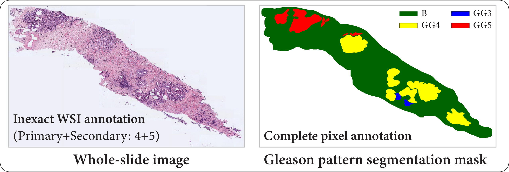

# SegGini: 
### SEGmentation using Graphs with Inexact aNd Incomplete labels 

This repository contains the code to reproduce the results of ["Learning Whole-Slide Segmentation from Inexact and Incomplete Labels using Tissue Graphs"](https://arxiv.org/pdf/2103.03129.pdf), MICCAI, 2021. 

The code is built on the [`Histocartography`](https://github.com/histocartography/histocartography) library, a python-based package that facilitates the modelling and learning of pathology images as graphs. 

The described experiments are presented for the [`SICAPv2`](https://data.mendeley.com/datasets/9xxm58dvs3/1) dataset, a cohort of Hematoxylin and Eosin (H&amp;E) stained prostate needle biopsies. 

### Overview


## Installation 

### Cloning and handling dependencies 

Clone the repo:

```
git clone git@github.com:histocartography/seg-gini.git && cd seg-gini
```

Create a conda environment and activate it:

```
conda env create -f environment.yml
conda activate seggini
```

### Downloading and preparing the SICAPv2 dataset 

[`SICAPv2`](https://data.mendeley.com/datasets/9xxm58dvs3/1) is a database of H&amp;&E stained patches (512x512 pixels) from 155 prostate whole-slide images (WSIs) across 95 patients. The dataset contains local patch-level segmentation masks for Gleason patterns (Non-cancerous, Grade3, Grade4, Grade5) and global Gleason scores (Primary + Secondary).  

The SICAPv2 dataset downloading, the construction of WSIs, and the slide-level Gleason pattern segmentation masks can be created by running:

```
cd bin
python create_sicap_data.py --base_path <PATH-TO-STORE-WSIs>
```

A sample WSI and corresponding segmentation mask is demonstrated as follows. To highlight, the available Gleason score is inexact as it only states the worst and the second worst Gleason pattern present in the WSI. 


  

## Running the code 

SegGini aims to leverage the WSI-level inexact supervision and incomplete pixel-level annotations for semantically segmenting the Gleason patterns in the WSI. To this end, first it translates a WSI into a `Tissue-graph` representation, and then employs Graph Neural Network based `Graph-head` and `Node-head`.


### Step 1: Tissue-graph representation 

The WSI to Tissue-graph transformation can be generated by running: 

```
cd bin
python preprocess.py --base_path <PATH-TO-STORED-WSIs>
```

The script creates three directories with the following content per WSI:
- a tissue graph as a `.bin` file
- a superpixel map as a `.h5` file
- a tissue mask as a `.png` file

Here, we also parse the available image and pixel annotations to create the necessary pickle files, to be used during `training` phase.

Finally, the directories should look like:

```
SICAPv2-data
|
|__ preprocess
|   |
|   |__ graphs
|   |
|   |__ superpixels 
|   |
|   |__ tissue_masks 
|
|__ pickles
    |
    |_ images.pickle
    |
    |_ annotation_masks_100.pickle 
    |
    |_ image_level_annotations.pickle

```


### Step 2: Training SegGini 

We provide the option to train 3 types of models, namely a Cell Graph model, Tissue Graph model and HACTNet model. 


Training HACTNet as:

```
python train.py --cg_path <SOME-SAVE-PATH>/hact-net-data/cell_graphs/ --tg_path <SOME-SAVE-PATH>/hact-net-data/tissue_graphs/ --assign_mat_path <SOME-SAVE-PATH>/hact-net-data/assignment_matrices/  --config_fpath ../data/config/hact_bracs_hactnet_7_classes_pna.yml -b 8 --in_ram --epochs 60 -l 0.0005 
```


Training a Cell Graph model as:

```
python train.py --cg_path <SOME-SAVE-PATH>/hact-net-data/cell_graphs/ --config_fpath ../data/config/cg_bracs_cggnn_7_classes_pna.yml -b 8 --in_ram --epochs 60 -l 0.0005 

```

Training a Tissue Graph model as:

```
python train.py --tg_path <SOME-SAVE-PATH>/hact-net-data/tissue_graphs/ --config_fpath ../data/config/tg_bracs_tggnn_7_classes_pna.yml -b 8 --in_ram --epochs 60 -l 0.0005 

```

Usage is:

```
usage: train.py [-h] [--cg_path CG_PATH] [--tg_path TG_PATH]
                [--assign_mat_path ASSIGN_MAT_PATH] [-conf CONFIG_FPATH]
                [--model_path MODEL_PATH] [--in_ram] [-b BATCH_SIZE]
                [--epochs EPOCHS] [-l LEARNING_RATE] [--out_path OUT_PATH]
                [--logger LOGGER]

optional arguments:
  -h, --help            show this help message and exit
  --cg_path CG_PATH     path to the cell graphs.
  --tg_path TG_PATH     path to tissue graphs.
  --assign_mat_path ASSIGN_MAT_PATH
                        path to the assignment matrices.
  -conf CONFIG_FPATH, --config_fpath CONFIG_FPATH
                        path to the config file.
  --model_path MODEL_PATH
                        path to where the model is saved.
  --in_ram              if the data should be stored in RAM.
  -b BATCH_SIZE, --batch_size BATCH_SIZE
                        batch size.
  --epochs EPOCHS       epochs.
  -l LEARNING_RATE, --learning_rate LEARNING_RATE
                        learning rate.
  --out_path OUT_PATH   path to where the output data are saved (currently
                        only for the interpretability).
  --logger LOGGER       Logger type. Options are "mlflow" or "none"
```

The output of this script will be a directory containing three models corresponding to the best validation loss, validation accuracy and weighted F1-score. 

### (Step 3: Inference on HACTNet)

We also provide a script for running inference with the option to use a pretrained model.

For instance, running inference with a pretrained HACTNet model: 

```
python inference.py --cg_path <SOME-SAVE-PATH>/hact-net-data/cell_graphs/ --tg_path <SOME-SAVE-PATH>/hact-net-data/tissue_graphs/ --assign_mat_path <SOME-SAVE-PATH>/hact-net-data/assignment_matrices/  --config_fpath ../data/config/hact_bracs_hactnet_7_classes_pna.yml --pretrained
```

We provide 3 pretrained checkpoints performing as:

| Model | Accuracy | Weighted F1-score |
| ----- |:--------:|:-----------------:|
| Cell Graph Model   | 58.1 | 56.7 |
| Tissue Graph Model | 58.6 | 57.8 |
| HACTNet Model      | 61.7   | 61.5 |


If you use this code, please consider citing our work:

```
@inproceedings{pati2021,
    title = "Hierarchical Graph Representations in Digital Pathology",
    author = "Pushpak Pati, Guillaume Jaume, Antonio Foncubierta, Florinda Feroce, Anna Maria Anniciello, Giosuè Scognamiglio, Nadia Brancati, Maryse Fiche, Estelle Dubruc, Daniel Riccio, Maurizio Di Bonito, Giuseppe De Pietro, Gerardo Botti, Jean-Philippe Thiran, Maria Frucci, Orcun Goksel, Maria Gabrani",
    booktitle = "arXiv",
    url = "https://arxiv.org/abs/2102.11057",
    year = "2021"
} 
```

